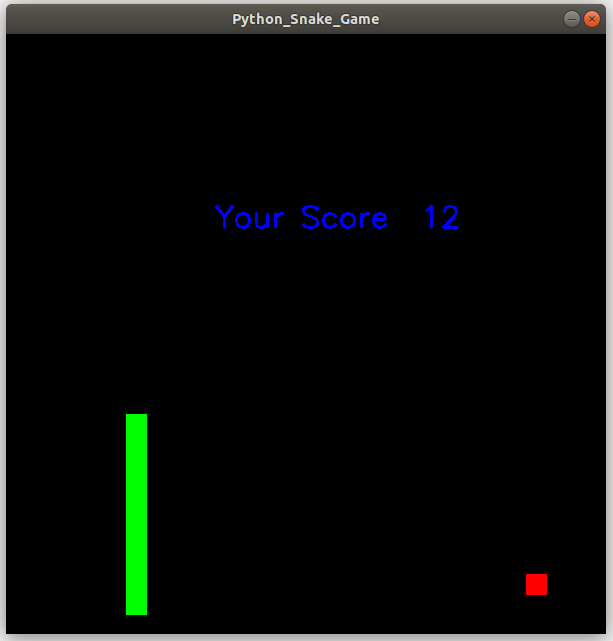

# Py_Snake_Game
Reviving Nokia 6110 Snake Game with Python

 

**Installations**
1. Install pip
* Download `get-pip.py` file from https://bootstrap.pypa.io/get-pip.py
(or)   use `curl https://bootstrap.pypa.io/get-pip.py -o get-pip.py`
* `python get-pip.py`

2. Install Numpy and OpenCV  
`pip install opencv-python`

**Usage**  
Run using python3 or python  
* `python __main__.py`
 

**Play with keys** 
 
* A or J for left  
* S or K for doown  
* D or L for right  
* W or I for up  
